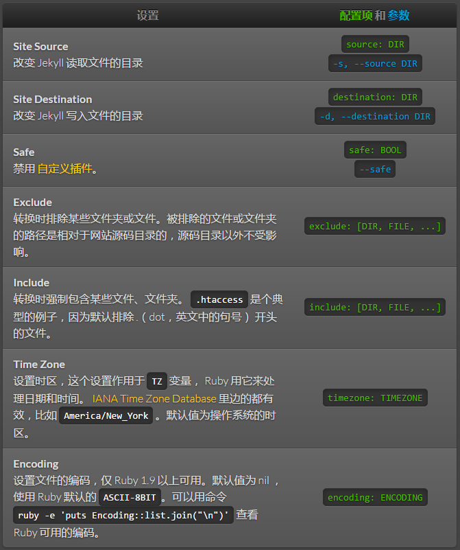
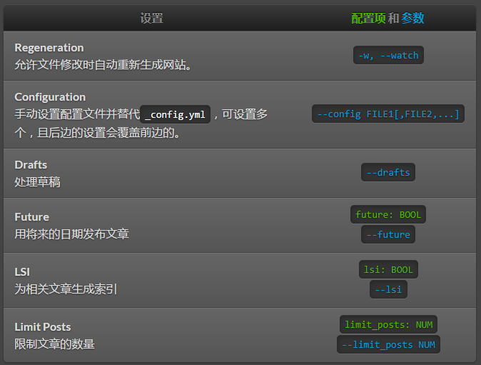
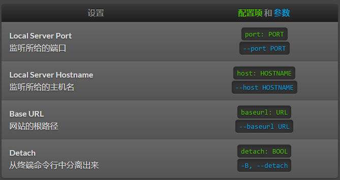

# 配置
Jekyll 帮你轻松的搭建你的网站，这很大程度上归功于灵活强大的配置功能。既可以在网站根目录下的 `_config.yml` 文件中进行配置，也可以作为命令行参数来配置。

## 配置设置

### 全局配置
下表中列举了所有 Jekyll 可用的设置，和多种多样的 `配置项 `(配置文件中) 及 `参数` (命令行中)。



### 编译选项


### 服务选项

除了下边的选项， `serve` 命令还可以接收 `build` 的选项，当运行网站服务之前的编译时候使用。


> 不要在配置文件中使用 tab 制表符
> 这将造成解析错误，或倒回到默认设置。请使用空格替代。

## 默认配置

Jekyll 默认使用以下的配置。除非在配置文件中存在相同的配置项或在命令行中指定参数，否则 Jekyll 将使用以下配置运行。

> 有两个 kramdown 的选项不被支持
>注意 Jekyll 目前不支持 `remove_block_html_tags` 和 `remove_span_html_tags` ，因为没有被包含到 kramdown HTML 转换器中。

```
source:      .
destination: ./_site
plugins:     ./_plugins
layouts:     ./_layouts
include:     ['.htaccess']
exclude:     []
keep_files:  ['.git','.svn']
gems:        []
timezone:    nil
encoding:    nil

future:      true
show_drafts: nil
limit_posts: 0
highlighter: pygments

relative_permalinks: true

permalink:     date
paginate_path: 'page:num'
paginate:      nil

markdown:      maruku
markdown_ext:  markdown,mkd,mkdn,md
textile_ext:   textile

excerpt_separator: "\n\n"

safe:        false
watch:       false    # deprecated
server:      false    # deprecated
host:        0.0.0.0
port:        4000
baseurl:     /
url:         http://localhost:4000
lsi:         false

maruku:
  use_tex:    false
  use_divs:   false
  png_engine: blahtex
  png_dir:    images/latex
  png_url:    /images/latex
  fenced_code_blocks: true

rdiscount:
  extensions: []

redcarpet:
  extensions: []

kramdown:
  auto_ids: true
  footnote_nr: 1
  entity_output: as_char
  toc_levels: 1..6
  smart_quotes: lsquo,rsquo,ldquo,rdquo
  use_coderay: false

  coderay:
    coderay_wrap: div
    coderay_line_numbers: inline
    coderay_line_numbers_start: 1
    coderay_tab_width: 4
    coderay_bold_every: 10
    coderay_css: style

redcloth:
  hard_breaks: true
```

## Markdown 选项
Jekyll 支持的 Markdown 渲染器中有的有额外的选项。

### Redcarpet
Redcarpet支持设置 `extensions` ，值为一个字符串数组，每个字符串都是 `Redcarpet::Markdown` 类的扩展，相应的扩展就会设置为 `true` 。

Jekyll handles two special Redcarpet extensions:
- `no_fenced_code_blocks` — 默认的， Jekyll 设置扩展 `fenced_code_blocks` (用三个波浪线或重音线标记代码区间) 为 `true` ，这或许是跟 GitHub 积极的采用有关。当使用 Jekyll 的时候， Redcarpet 的扩展 `fenced_code_blocks` 无效，作为替代方案，你可以这样做：
注意你还可以这样来配置语言以支持语法高亮：


  ```ruby
  # ...ruby code
  ```

有了 both fenced code blocks 和 pygments ，就会直接高亮代码了；如果没有 pygments，将增加一个 `class="LANGUAGE"` 属性到 `<code>` 元素，用于给不同的 JavaScript 代码高亮库做后续处理。
- `smart` — 打开 SmartyPants ，将引号转为 " 、连字符转为 em (`---`) 和 en (`--`) 破折号。
Redcarpet 所有其他扩展保持他们本来的名字，并且在 Jekyll 中不能给 `smart` 加渲染选项。 [Redcarpet 的 README 中有可用扩展的列表](https://github.com/vmg/redcarpet/blob/v2.2.2/README.markdown#and-its-like-really-simple-to-use)。 确保你看的 README 是正确的版本： Jekyll 当前用的是 v2.2.x ，其中 `footnotes` 和 `highlight` 在 3.0.0 以后才会支持。最常用的扩展是如下：

- `tables`
- `no_intra_emphasis`
- `autolink`

### Kramdown
除了上述提到的默认配置，你还可以给 Kramdown 传递值为 “GFM” 的 `input` 选项，从而启用 Github 扩展的 Markdown 语法。

例如，在 `_config.yml` 文件中加入以下配置项：
kramdown:
  input: GFM