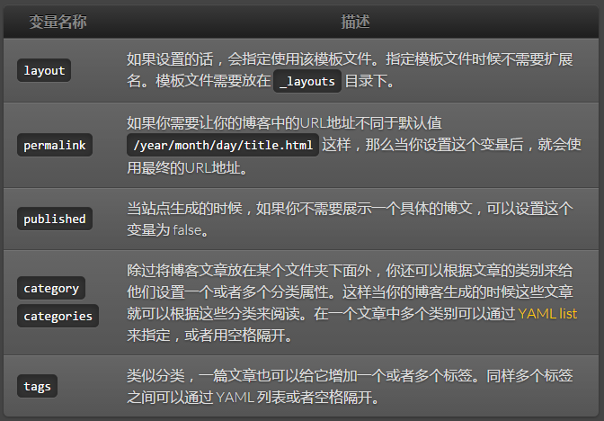
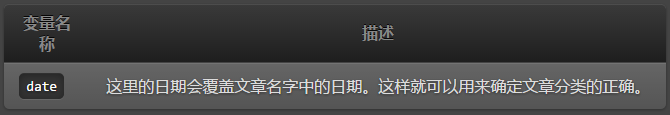

# 头信息
正是头信息开始让 Jekyll 变的很酷。任何只要包含 [YAML](http://yaml.org/) 头信息的文件在 Jekyll 中都能被当做一个特殊的文件来处理。头信息必须在文件的开始部分，并且需要按照 YAML 的格式写在两行三虚线之间。下面是一个基本的例子：

```
---
layout: post
title: Blogging Like a Hacker
---
```

在这两行的三虚线之间，你可以设置一些预定义的变量（下面这个例子可以作为参考）或者甚至创建一个你自己定义的变量。这样在接下来的文件和任意模板中或者在包含这些页面或博客的模板中都可以通过使用 Liquid 标签来访问这些变量。

> UTF-8 编码方式警告
如果你使用 UTF-8 编码，那么在你的文件中一定不要出现 `BOM` 头字符，否则你会碰上非常糟糕的事情，尤其当你在 Windows 上使用 Jekyll 的时候。

>提示™：头信息变量是可选的
如果你想使用 [Liquid 标签和变量](http://jekyll.bootcss.com/docs/variables/)但是在头信息中又不需要任何定义，那么你可以将头信息设置为空！在头信息为空的情况下，Jekyll 仍然能够处理文件。（这对于一些像 CSS 和 RSS 的文件非常有用）

## 预定义的全局变量
你可以在页面或者博客的头信息处使用一些已经预定义好的全局变量。



## 自定义变量
在头信息中没有预先定义的任何变量都会在数据转换中通过 Liquid 模板被调用。例如，在头信息中你设置一个 title，然后就可以在你的模板中使用这个 title 变量来设置页面的 title 属性 ：

```
<!DOCTYPE HTML>
<html>
  <head>
    <title>{{ page.title }}</title>
  </head>
  <body>
    ...
```

## 在文章中预定义的变量
在文章中可以使用这些在头信息变量列表中未包含的变量。
