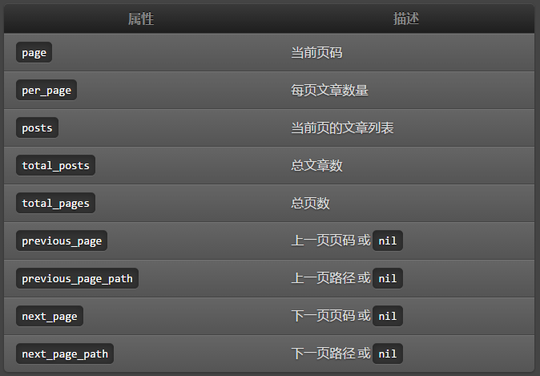

# 分页功能

对于大多数网站（尤其是博客），当文章越来越多的时候，就会有分页显示文章列表的需求。 Jekyll 已经自建 分页功能，你只需要根据约定放置文件即可。

> 分页功能只支持 HTML 文件
> Jekyll 的分页功能不支持 Markdown 或 Textile 文件，而是只支持 HTML 文件。当然，这不会让 你不爽。

## 开启分页功能

开启分页功能很简单，只需要在 `_config.yml` 里边加一行，并填写每页需要几行：

```
paginate: 5
```

下边是对需要带有分页页面的配置：

```
paginate_path: "blog/page:num"
```

`blog/index.html `将会读取这个设置，把他传给每个分页页面，然后从第` 2` 页开始输出到 `blog/page:num `， `:num` 是页码。如果有 12 篇文章并且做如下配置 `paginate: 5 `， Jekyll 会将前 5 篇文章写入 `blog/index.html` ，把接下来的 5 篇文章写入 `blog/page2/index.html`，最后 2 篇写入 `blog/page3/index.html`。

## 与 paginator 相同的属性



> 不支持对“标签”和“类别”分页
> 分页功能仅仅遍历文章列表并计算出结果，并无读取 YAML 头信息，现在不支持对“标签”和“类别”分页。

## 生成带分页功能的文章

接下来要做的事情就是展现在页面上了，下边是一个简单的例子：

```
---
layout: default
title: My Blog
---

<!-- 遍历分页后的文章 -->

  <h1><a href="{{ post.url }}">{{ post.title }}</a></h1>
  <p class="author">
    <span class="date">{{ post.date }}</span>
  </p>
  <div class="content">
    {{ post.content }}
  </div>


<!-- 分页链接 -->
<div class="pagination">
  
    <a href="/page{{ paginator.previous_page }}" class="previous">Previous</a>
  
    <span class="previous">Previous</span>
  
  <span class="page_number ">Page: {{ paginator.page }} of {{ paginator.total_pages }}</span>
  
    <a href="/page{{ paginator.next_page }}" class="next">Next</a>
  
    <span class="next ">Next</span>
  
</div>
```

> 注意首尾页
> Jekyll 没有生成文件夹 ‘page1’ ，所以上边的代码有 bug ，下边的代码解决了这个问题。
下边的 HTML 片段是第一页，他除自己外，为每个页面生成了链接。

```

<div class="pagination">
  
    <a href="{{ paginator.previous_page_path | prepend: site.baseurl | replace: '//', '/' }}">&laquo; Prev</a>
  
    <span>&laquo; Prev</span>
  

  
    
      <em>{{ page }}</em>
    
      <a href="{{ '/index.html' | prepend: site.baseurl | replace: '//', '/' }}">{{ page }}</a>
    
      <a href="{{ site.paginate_path | prepend: site.baseurl | replace: '//', '/' | replace: ':num', page }}">{{ page }}</a>
    
  

  
    <a href="{{ paginator.next_page_path | prepend: site.baseurl | replace: '//', '/' }}">Next &raquo;</a>
  
    <span>Next &raquo;</span>
  
</div>

```