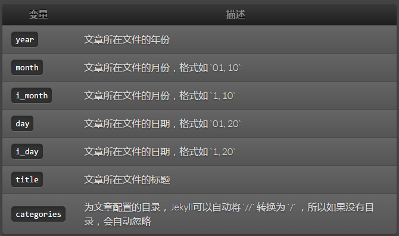
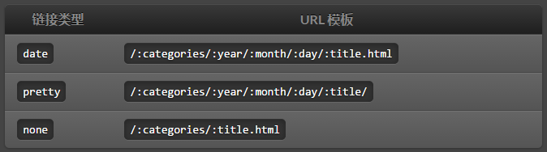
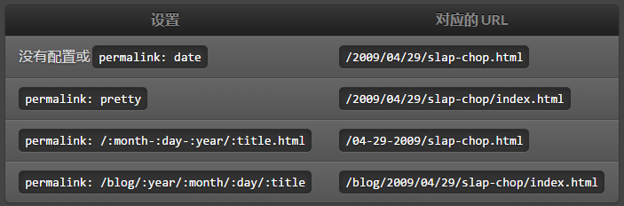

# 永久链接

Jekyll 支持以灵活的方式管理你网站的链接，你可以通过 [Configuration](http://jekyll.bootcss.com/docs/configuration/) 或 [YAML 头信息](http://jekyll.bootcss.com/docs/frontmatter/) 为每篇文章设置永久链接。你可以随心所欲的选择你自己的 格式，即使自定义。默认配置为 `date`。

永久链接的模板用以冒号为前缀的关键词标记动态内容，比如 `date` 代表 `/:categories/:year/:month/:day/:title.html` 。

## 模板变量

## 已经建好的链接类型

## 举例

比如文件名：` /2009-04-29-slap-chop.textile`

