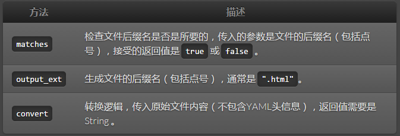
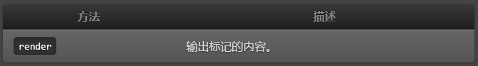
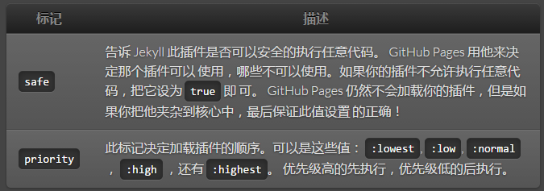

# 插件

Jekyll 支持插件功能，你可以很容易的加入自己的代码。

> 在 GitHub Pages 使用插件
> [GitHub Pages](http://pages.github.com/) 是由 Jekyll 提供技术支持的，考虑到安全因素，所有的 Pages 通过 `--safe` 选项禁用了插件功能，因此如果你的网站部署在 Github Pages ，那么你的插件不会工作。

不过仍然有办法发布到 GitHub Pages，你只需在本地做一些转换，并把生成好的文件上传到 Github 替代 Jekyll 就可以了。

## 安装插件

有两种安装插件的方式：

1. 在网站根下目录建立 `_plugins` 文件夹，插件放在这里即可。 Jekyll 运行之前，会加载此目录下所有以 `*.rb` 结尾的文件。

2. 在 `_config.yml` 文件中，添加一个以 `gems` 作为 key 的数组，数组中存放插件的 gem 名称。例如：

```
 gems: [jekyll-test-plugin, jekyll-jsonify, jekyll-assets]
 # This will require each of these gems automatically.
```

> `_plugins` and `gems` 可以同时使用。
> You may use both of the aforementioned plugin options simultaneously in the same site if you so choose. Use of one does not restrict the use of the other

通常，插件最终会被放在以下的目录中：

1. Generators
2. Converters
3. Tags

## 生成器

You can create a generator when you need Jekyll to create additional content based on your own rules.

A generator is a subclass of `Jekyll::Generator` that defines a `generate` method, which receives an instance of [Jekyll::Site](https://github.com/jekyll/jekyll/blob/master/lib/jekyll/site.rb).

Generation is triggered for its side-effects, the return value of `generate` is ignored. Jekyll does not assume any particular side-effect to happen, it just runs the method.

Generators run after Jekyll has made an inventory of the existing content, and before the site is generated. Pages with YAML front-matters are stored as instances of [Jekyll::Page](https://github.com/jekyll/jekyll/blob/master/lib/jekyll/page.rb) and are available via `site.pages`. Static files become instances of [Jekyll::StaticFile](https://github.com/jekyll/jekyll/blob/master/lib/jekyll/static_file.rb) and are available via `site.static_files`. See [Jekyll::Site](https://github.com/jekyll/jekyll/blob/master/lib/jekyll/site.rb) for more details.

For instance, a generator can inject values computed at build time for template variables. In the following example the template `reading.html` has two variables `ongoing` and `done `that we fill in the generator:

```
module Reading
  class Generator < Jekyll::Generator
    def generate(site)
      ongoing, done = Book.all.partition(&:ongoing?)

      reading = site.pages.detect {|page| page.name == 'reading.html'}
      reading.data['ongoing'] = ongoing
      reading.data['done'] = done
    end
  end
end
```

This is a more complex generator that generates new pages:

```
module Jekyll

  class CategoryPage < Page
    def initialize(site, base, dir, category)
      @site = site
      @base = base
      @dir = dir
      @name = 'index.html'

      self.process(@name)
      self.read_yaml(File.join(base, '_layouts'), 'category_index.html')
      self.data['category'] = category

      category_title_prefix = site.config['category_title_prefix'] || 'Category: '
      self.data['title'] = "#{category_title_prefix}#{category}"
    end
  end

  class CategoryPageGenerator < Generator
    safe true

    def generate(site)
      if site.layouts.key? 'category_index'
        dir = site.config['category_dir'] || 'categories'
        site.categories.keys.each do |category|
          site.pages << CategoryPage.new(site, site.source, File.join(dir, category), category)
        end
      end
    end
  end

end
```

本例中，生成器在 `categories` 下生成了一系列文件。并使用布局 `category_index.html` 列出所有的文章。

生成器只需要实现一个方法：

|METHOD|	DESCRIPTION|
|------|---------------|
|generate| Generates content as a side-effect.|

## 转换器

如果想使用一个新的标记语言，可以用你自己的转换器实现，Markdown 和 Textile 就是这样实现的。

> 记住你的 YAML 头信息
> Jekyll 只会转换带有 YAML 头信息的文件，即使你使用了插件也不行。

下边的例子实现了一个转换器，他会用 `UpcaseConverter` 来转换所有以 `.upcase` 结尾的文件。

```
module Jekyll
  class UpcaseConverter < Converter
    safe true
    priority :low

    def matches(ext)
      ext =~ /^\.upcase$/i
    end

    def output_ext(ext)
      ".html"
    end

    def convert(content)
      content.upcase
    end
  end
end
```

转换器需要最少实现以下 3 个方法：



在上边的例子中， `UpcaseConverter#matches `检查文件后缀名是不是 `.upcase` ; `UpcaseConverter#convert` 会处理检查成功文件的内容，即将所有的字符串变成大写；最终，保存的结果 将以作为后缀名 `.html` 。

## 标记

如果你想使用 liquid 标记，你可以这样做。 Jekyll 官方的例子有 `highlight` 和 `include` 等标记。下边的例子中，自定义了一个 liquid 标记，用来输出当前时间：

```
module Jekyll
  class RenderTimeTag < Liquid::Tag

    def initialize(tag_name, text, tokens)
      super
      @text = text
    end

    def render(context)
      "#{@text} #{Time.now}"
    end
  end
end

Liquid::Template.register_tag('render_time', Jekyll::RenderTimeTag)
```

liquid 标记最少需要实现如下方法：



你必须同时用 Liquid 模板引擎注册自定义标记，比如：：

```
Liquid::Template.register_tag('render_time', Jekyll::RenderTimeTag)
```

对于上边的例子，你可以把如下标记放在页面的任何位置：

```
<p></p>
```

我们在页面上会得到如下内容：

```
<p>page rendered at: Tue June 22 23:38:47 –0500 2010</p>
```

### Liquid 过滤器

你可以像上边那样在 Liquid 模板中加入自己的过滤器。过滤器会把自己的方法暴露给 liquid 。所有的方法 都必须至少接收一个参数，用来传输入内容；返回值是过滤的结果。

```
module Jekyll
  module AssetFilter
    def asset_url(input)
      "http://www.example.com/#{input}?#{Time.now.to_i}"
    end
  end
end

Liquid::Template.register_filter(Jekyll::AssetFilter)
```

> 提示™：用 Liquid 访问 site 对象
Jekyll 允许通过 Liquid 的 `context.registers` 特性来访问  site 对象。比如可以用` context.registers.config` 访问配置文件 `_config.yml` 。

### Flags

当写插件时，有两个标记需要注意：



已上边例子的插件为例，应该这样设置这两个标记：

```
module Jekyll
  class UpcaseConverter < Converter
    safe true
    priority :low
    ...
  end
end
```

## 可用的插件

下边的插件，你可以按需所取：

生成器

 - ArchiveGenerator by Ilkka Laukkanen：用这里的方法生成档案。
 - LESS.js Generator by Andy Fowler：生成的时候产生 LESS.js 文件。
 - Version Reporter by Blake Smith：创建包含 Jekyll 版本的文件 version.html 。
 - Sitemap.xml Generator by Michael Levin：遍历所有的页面和文章，生成 sitemap.xml 。
 - Full-text search by Pascal Widdershoven：全文搜索。
 - AliasGenerator by Thomas Mango：根据YAML头信息中的 alias　生成跳转页面。
 - Pageless Redirect Generator by Nick Quinlan：根据Jekyll跟路径做出跳转，支持分布式。
 - Projectlist by Frederic Hemberger：一个文件夹生成一个页面
 - RssGenerator by Assaf Gelber：自动生成 RSS 2.0 。
 - Monthly archive generator by Shigeya Suzuki: Generator and template which renders monthly archive like MovableType style, based on the work by Ilkka Laukkanen and others above.
 - Category archive generator by Shigeya Suzuki: Generator and template which renders category archive like MovableType style, based on Monthly archive generator.
 - Emoji for Jekyll: Seamlessly enable emoji for all posts and pages.
 - Compass integration for Jekyll: Easily integrate Compass and Sass with your Jekyll website.

转换器

 - Jade plugin by John Papandriopoulos： Jade 转换器。
 - HAML plugin by Sam Z: HAML转换器。
 - HAML-Sass Converter by Adam Pearson: HAML-Sass 转换器。 Fork by Sam X.
 - Sass SCSS Converter by Mark Wolfe：在Sam X 的基础上，一个兼容 CSS 的 Sass 转换器。
 - LESS Converter by Jason Graham: 将 LESS 转换为 CSS。
 - LESS Converter by Josh Brown: 简单的 LESS 转换器。
 - Upcase Converter by Blake Smith: 一个例子 。
 - CoffeeScript Converter by phaer: CoffeeScript 转换到 JavaScript 。
 - Markdown References by Olov Lassus: 记录所有的超链接到 _references.md 文件。
 - Stylus Converter: 将 .styl 转换为 .css 。
 - ReStructuredText Converter: 用 Pygments 语法将 ReST 文档转换为 HTML 。
 - Jekyll-pandoc-plugin: 用 pandoc 转换 markdown 。
 - Jekyll-pandoc-multiple-formats by edsl:用 pandoc 生成网站，支持多种格式，并支持 pandoc 的后缀名。
 - ReStructuredText Converter: 又一个用 Pygments 语法将 ReST 文档转换为 HTML 。
 - Transform Layouts: 允许使用 HAML 布局（需要 HAML 转换器的配合）
 - Org-mode Converter: Org-mode converter for Jekyll.

过滤器

 - Truncate HTML by Matt Hall: 为保持 markup 结构，删除 HTML 标签。
 - Domain Name Filter by Lawrence Woodman: 过滤出域名。
 - Summarize Filter by Mathieu Arnold: 去掉 <div id="extended"> 后边的内容。
 - URL encoding by James An:为地址编码，如 ' ' #=> '%20' 。
 - JSON Filter by joelverhagen: 转换为 JSON 格式。
 - i18n_filter:实现了 I18n 国际化的 Liquid 过滤器。
 - Smilify by SaswatPadhi: 将表情符号转换为表情图片 (例子)。
 - Read in X Minutes by zachleat: 估计读完文章需要的时间。
 - Jekyll-timeago: 把时间转换为 time ago 格式。
 - pluralize: 根据单词前边的数字按需转换成复数形式。
 - reading_time: 统计字数，并估计需要读的时间（已忽略HTML标签）。
 - Table of Content Generator: 生成包含表格（ TOC ）的 HTML 代码，支持自定义。
 - jekyll-humanize: This is a port of the Django app humanize which adds a “human touch” to data. Each method represents a Fluid type filter that can be used in your Jekyll site templates. Given that Jekyll produces static sites, some of the original methods do not make logical sense to port (e.g. naturaltime).

标签

 - Asset Path Tag by Sam Rayner: Allows organisation of assets into subdirectories by outputting a path for a given file relative to the current post or page.
 - Delicious Plugin by Christian Hellsten: 从 delicious.com 获取书签并展示。
 - Ultraviolet Plugin by Steve Alex: Ultraviolet 插件。
 - Tag Cloud Plugin by Ilkka Laukkanen: 生成云状的标签列表。
 - GIT Tag by Alexandre Girard: 添加 Git activity 。
 - MathJax Liquid Tags by Jessy Cowan-Sharp:用合适的 MathJax 标签替代相应的数学公式或方程式。
 - Non-JS Gist Tag by Brandon Tilley: 嵌入 Gists ，显示给禁用 JavaScript 的用户。
 - Render Time Tag by Blake Smith: 显示页面的创建时间。
 - Status.net/OStatus Tag by phaer: 显示 status.net/ostatus 的通知。
 - Raw Tag by phaer: 阻止转换 raw 标签的内容。
 - Embed.ly client by Robert Böhnke: Embed.ly 的实现。
 - Logarithmic Tag Cloud: 支持对数。
 - oEmbed Tag by Tammo van Lessen: 通过 oEmbed 支持内嵌第三方代码 (例如 YouTube, Flickr, Slideshare) 。
 - FlickrSetTag by Thomas Mango: 将 Flickr 的图片生成画廊。
 - Tweet Tag by Scott W. Bradley: Tweets 支持 。
 - Jekyll-contentblocks: 支持使用 Rails 风格的 content_for 标签。
 - Generate YouTube Embed by joelverhagen:支持以 YouTube ID 嵌入 YouTube 视频，宽高可配置。
 - Jekyll-beastiepress: 可轻松连接到 FreeBSD 官网。
 - Jsonball: 读取json文件并生成地图。
 - Bibjekyll: Render BibTeX-formatted bibliographies/citations included in posts and pages using bibtex2html.
 - Jekyll-citation: 生成 BibTeX格式（ Holy shit! 还有多少要翻译）。
 - Jekyll Dribbble Set Tag: 生成 Dribbble 画廊。
 - Debbugs:可以轻松的链接到 Debian BTS 。
 - Refheap_tag: 支持refheap.
 - Jekyll-devonly_tag: 仅在开发环境使用的情况下可以考虑一下。
 - JekyllGalleryTag by redwallhp: 生成缩略图，并展示。
 - Youku and Tudou Embed: 支持内嵌 Youku 和 Tudou 视频。
 - Jekyll-swfobject: 通过 SWFObject 支持内嵌 flash 。
 - Jekyll Picture Tag: 相应式的图片，推荐 <picture> ，改编自 Scott Jehl 的 Picturefill.
 - Jekyll Image Tag: 更好的图片处理插件，预先保存，生成调整大小后的图片，并且加好 classes 和 alt 等属性。
 - Ditaa Tag by matze: 将 ditta 格式的 ASCII 图片转换成 PNG。
 - Good Include by Anatol Broder: 去掉文件末尾的空行空格。
 - Jekyll Suggested Tweet by David Ensinger: 通过 Twitter 的 API 支持内嵌感兴趣的 tweets。
 - Jekyll Date Chart by GSI: Block that renders date line charts based on textile-formatted tables.
 - Jekyll Image Encode by GSI: Tag that renders base64 codes of images fetched from the web.
 - Jekyll Quick Man by GSI: Tag that renders pretty links to man page sources on the internet.
 - jekyll-font-awesome: Quickly and easily add Font Awesome icons to your posts.

集合

 - Jekyll Plugins by Recursive Design: 生成 readme 说明文档，列表页以及网站地图。
 - Company website and blog plugins by Flatterline, a Ruby on Rails development company: Portfolio/project 的生成器, team/individual 的生成器，等等。
 - Jekyll plugins by Aucor: 移除不需要的空格空行，并根据 weight 属性给页面排序。

其他

 - Pygments Cache Path by Raimonds Simanovskis: 缓存高亮代码核心模块。
 - Draft/Publish Plugin by Michael Ivey: 保存到草稿。
 - Growl Notification Generator by Tate Johnson: Jekyll 通知发送到 Growl 。
 - Growl Notification Hook by Tate Johnson: 同上，推荐指数更高一点，但是需要他的 “hook” 。
 - Related Posts by Lawrence Woodman: 重新实现关联，覆盖 site.related_posts 。
 - Tiered Archives by Eli Naeher: 创建 tiered模板变量，允许按年月分组。
 - Jekyll-localization: 支持本地化。
 - Jekyll-rendering: 一个渲染引擎。
 - Jekyll-pagination: 支持分页。
 - Jekyll-tagging: 生成云状标签。
 - Jekyll-scholar: 为学者定制。
 - Jekyll-asset_bundler: 将 JavaScript 和 CSS 最小化。
 - Jekyll-assets by ixti: Rails 风格的 assets pipeline（支持的资源 CoffeeScript, Sass, LESS 等等；设置依赖；最小化压缩； JST 模板；缓存处理等等）。
 - File compressor by mytharcher: 压缩 HTML 和 JavaScript 。
 - Jekyll-minibundle: 根据你选择的最小化工具绑定资源和处理缓存。
 - Singlepage-jekyll by JCB-K: 转换为单页网站。
 - generator-jekyllrb: Yeoman 的包装，一个工具集，还有工作流，用来创建现代化的网站。
 - grunt-jekyll：Grunt　插件。
 - jekyll-postfiles：添加目录 _postfiles　和标签 {{ postfile }}以保证所有的指向正确。
> 期待你的作品
> 如果你有一个 Jekyll 插件并且愿意加到这个列表中来，可以[阅读此须知](http://jekyll.bootcss.com/docs/contributing/)，并参照着来做。