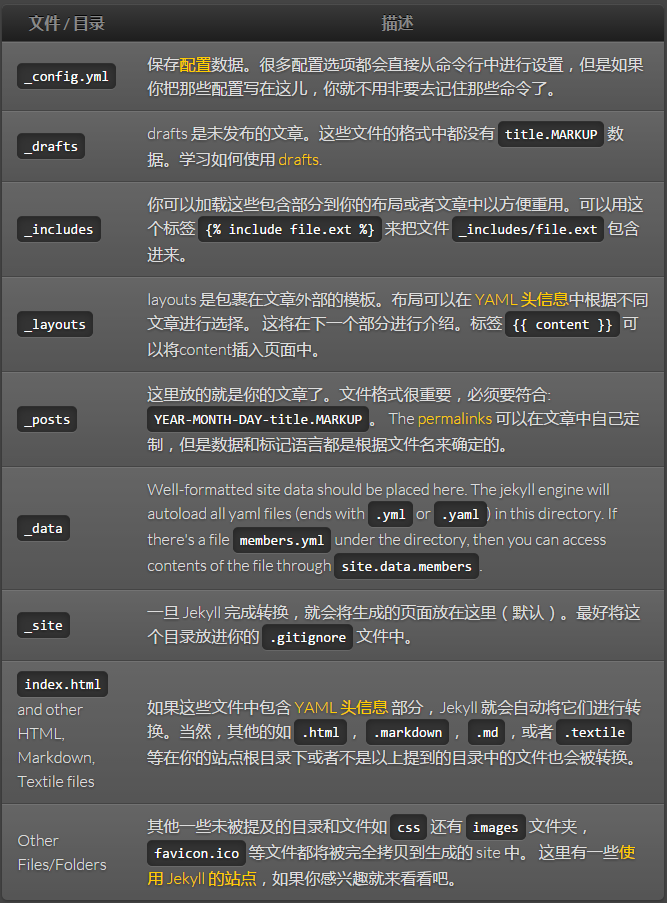

# 目录结构
Jekyll 的核心其实是一个文本转换引擎。它的概念其实就是： 你用你最喜欢的标记语言来写文章，可以是 Markdown，也可以是 Textile,或者就是简单的 HTML, 然后 Jekyll 就会帮你套入一个或一系列的布局中。在整个过程中你可以设置URL路径, 你的文本在布局中的显示样式等等。这些都可以通过纯文本编辑来实现，最终生成的静态页面就是你的成品了。

一个基本的 Jekyll 网站的目录结构一般是像这样的：

```
.
├── _config.yml
├── _drafts
|   ├── begin-with-the-crazy-ideas.textile
|   └── on-simplicity-in-technology.markdown
├── _includes
|   ├── footer.html
|   └── header.html
├── _layouts
|   ├── default.html
|   └── post.html
├── _posts
|   ├── 2007-10-29-why-every-programmer-should-play-nethack.textile
|   └── 2009-04-26-barcamp-boston-4-roundup.textile
├── _data
|   └── members.yml
├── _site
└── index.html
```

来看看这些都有什么用：

