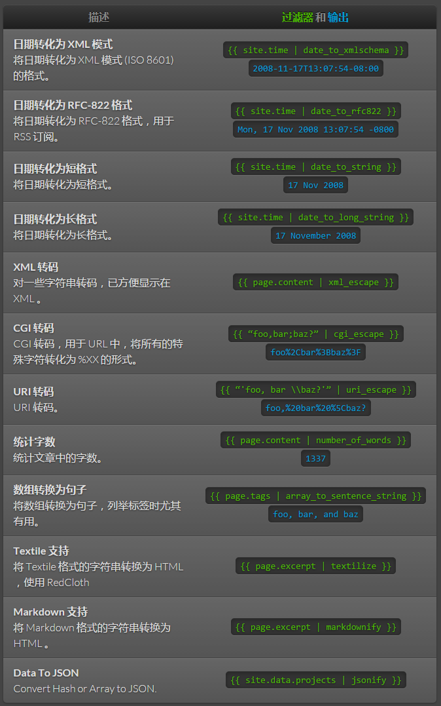

# 模板
Jekyll 使用 [Liquid](http://wiki.shopify.com/Liquid) 模板语言，支持所有标准的 Liquid [标签](http://wiki.shopify.com/Logic) 和 [过滤器](http://wiki.shopify.com/Filters) 。 Jekyll 甚至增加了几个过滤器和标签，方便使用。

## 过滤器



## 标签

### 引用

如果你需要在多个地方引用一小代码片段，可以使用 `include` 标签。

```

```

Jekyll 要求所有被引用的文件放在根目录的 `_includes` 文件夹，上述代码将把 `<source>/_includes/footer.html` 的内容包含进来。

> ProTip™: Use variables as file name
> The name of the file you wish to embed can be literal (as in the example above), or you can use a variable, using liquid-like variable syntax as in ``.

你还可以传递参数：

```

```

这些变量可以通过 Lquid 调用：

```
{{ include.param }}
```

### Code snippet highlighting

Jekyll 已经支持 [超过 100 种语言](http://pygments.org/languages/) 代码高亮显示，在此感谢 [Pygments](http://pygments.org/) 。要使用 Pygments ，你必须安装 Python 并且在配置文件中设置 `pygments` 为 `true` 。

Alternatively, you can use [Rouge](https://github.com/jayferd/rouge) to highlight your code snippets. It doesn’t support as many languages as Pygments does but it should fit in most cases and it’s written in pure Ruby ; you don’t need Python on your system!

使用代码高亮的例子如下：

```

def foo
  puts 'foo'
end

```

`highlight` 的参数 (本例中的 `ruby`) 是识别所用语言，要使用合适的识别器可以参照 [Lexers 页](http://pygments.org/docs/lexers/) 的 “short name” 。

### 行号

`highlight` 的第二个可选参数是 `linenos` ，使用了 `linenos `会强制在代码上加入行号。例如：

```

def foo
  puts 'foo'
end

```

### 代码高亮的样式

要使用代码高亮，你还需要包含一个样式。例如你可以在 [syntax.css](http://github.com/mojombo/tpw/tree/master/css/syntax.css) 找到，这里有 跟 GitHub 一样的样式，并且免费。如果你使用了 `linenos` ，可能还需要在 `syntax.css` 加入 `.lineno `样式。

### Post URL

如果你想使用你某篇文章的链接，标签 `post_url` 可以满足你的需求。

```

```

If you organize your posts in subdirectories, you need to include subdirectory path to the post:

```

```

当使用 `post_url `标签时，不需要写文件后缀名。

还可以用 Markdown 这样为你的文章生成超链接：

```
[Name of Link]()
```

### Gist

使用 `gist` 标签可以轻松的把 GitHub Gist 签入到网站中：

```

```

你还可以配置 gist 的文件名，用以显示：

```

```

`gist` 同样支持私有的 gists ，这需要 gist 所属的 github 用户名：

```

```

私有的 gist 同样支持文件名。