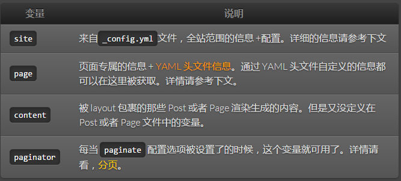
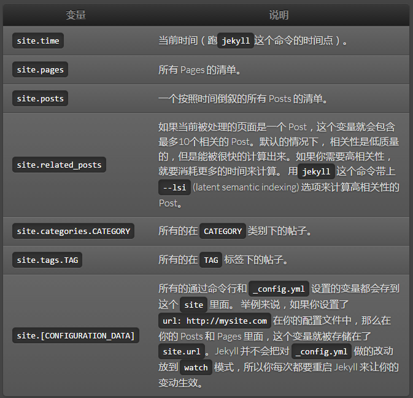
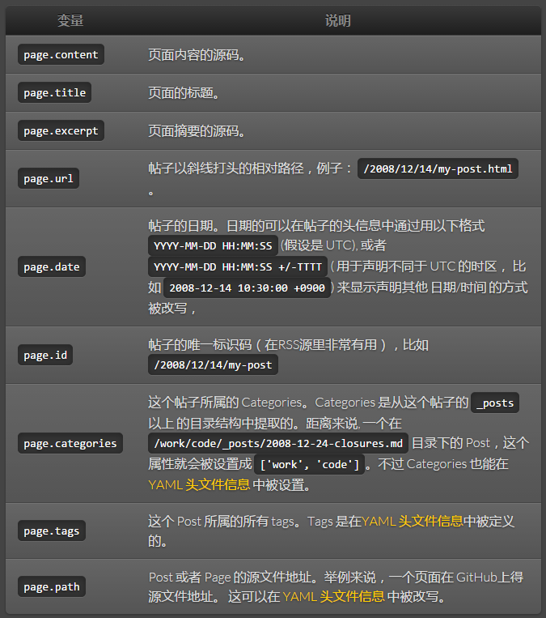

# 常用变量
Jekyll 会遍历你的网站搜寻要处理的文件。任何有 YAML 头信息的文件都是要处理的对象。对于每一个这样的文件，Jekyll 都会通过 Liquid 模板工具来生成一系列的数据。下面就是这些可用数据变量的参考和文档。

## 全局(Global)变量

## 全站(site)变量

## 页面(page)变量

> ProTip™: Use custom front-matter
> 任何你自定义的头文件信息都会在 `page` 中可用。 距离来说，如果你在一个 Page 的头文件中设置了 `custom_css: true`， 这个变量就可以这样被取到 `page.custom_css`。

## 分页器(Paginator)

> 分页器变量的可用性
这些变量仅在首页文件中可以，不过他们也会存在于子目录中，就像 `/blog/index.html`。